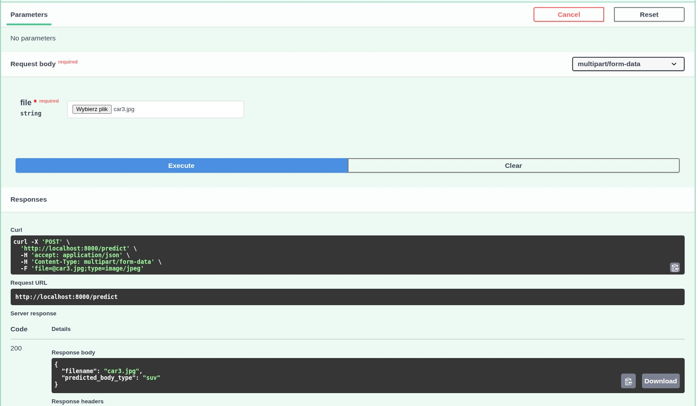

# Car Body Classifier API

This project is a complete MLOps pipeline that automates the process from data acquisition, through training a ResNet18 model using transfer learning, optimizing it to the ONNX format, and deploying a lightweight FastAPI microservice packaged in a Docker container.

## Project Features

- **Automation**: The `run_pipeline.sh` script runs the full process of environment setup, Kaggle data download, model training, and benchmarking for Linux deployment.
- **Optimization**: Converting the model to ONNX enables fast CPU inference.
- **Ready-to-use container**: The project includes a `Dockerfile` and configuration for immediate API deployment.

## Quick Start

To automatically prepare the environment, download the data, and train the model, run the script from the project root:

```bash
chmod +x run_pipeline.sh
./run_pipeline.sh
```

## Prerequisites

- Kaggle API: The project downloads data automatically using the `kagglehub` library. Make sure you have a `kaggle.json` file placed in `~/.kaggle/` (according to the Kaggle API documentation).
- Python 3.10+ and Docker.

## Docker Setup

1. Build the image

```bash
docker build -t car-classifier-api .
```

2. Run the container

```bash
docker run -d -p 8000:8000 car-classifier-api
```

After starting the application, open your browser at: [http://localhost:8000/docs](http://localhost:8000/docs)

There you will find the interactive Swagger UI documentation, which lets you test car body classification by uploading an image.

## File Structure

- `app.py`: FastAPI microservice code using ONNX Runtime.
- `resnet18.py`: Model training script (uses transfer learning with frozen weights).
- `export_to_onnx.py`: Script that converts the model from PyTorch to ONNX.
- `benchmark.py`: Performance comparison between PyTorch and ONNX Runtime.
- `Dockerfile`: Instructions for building a lightweight container for the API.
- `run_pipeline.sh`: Automation script that installs dependencies and runs the pipeline.

## Manual Test

The manual test was performed through the Swagger UI available at `/docs`. The API endpoint `POST /predict` was used with an uploaded image file. The request was sent as `multipart/form-data`, and the service returned a successful response with HTTP status code `200`.
Model was tested with image of my own car. 

The test result confirmed that the model correctly processed the input image and predicted the car body class as:

- `filename`: `car3.jpg`
- `predicted_body_type`: `suv`

### Manual Test Evidence



## Test Summary

The test confirmed that the FastAPI service is working correctly, the ONNX model is being loaded properly, and the `/predict` endpoint returns valid predictions for uploaded images.
